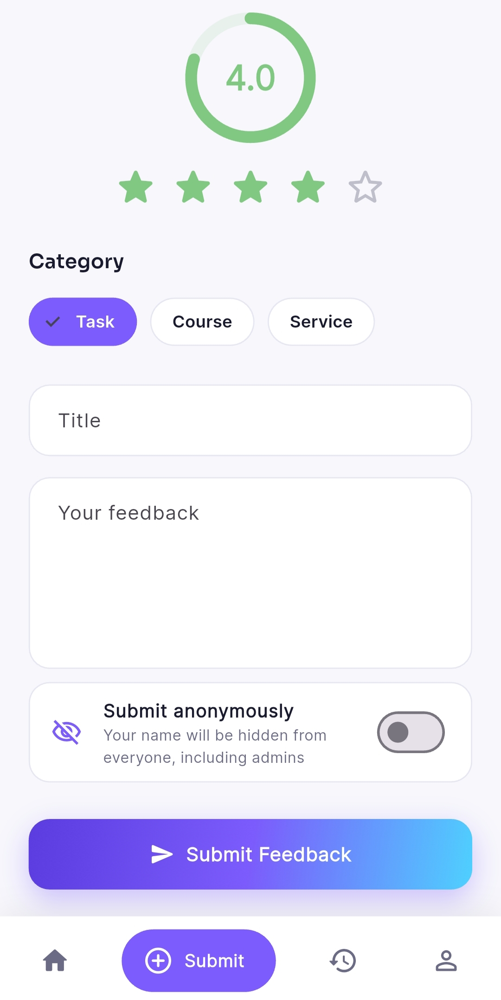
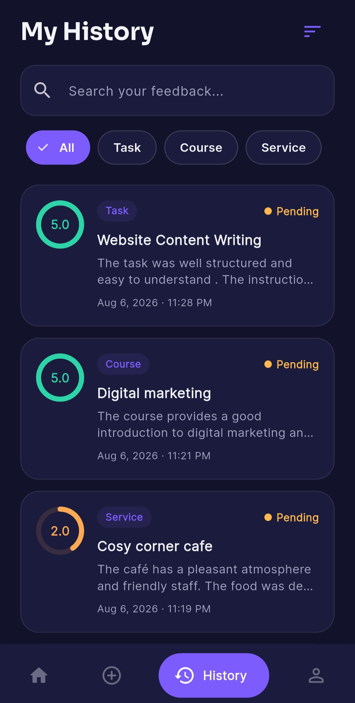
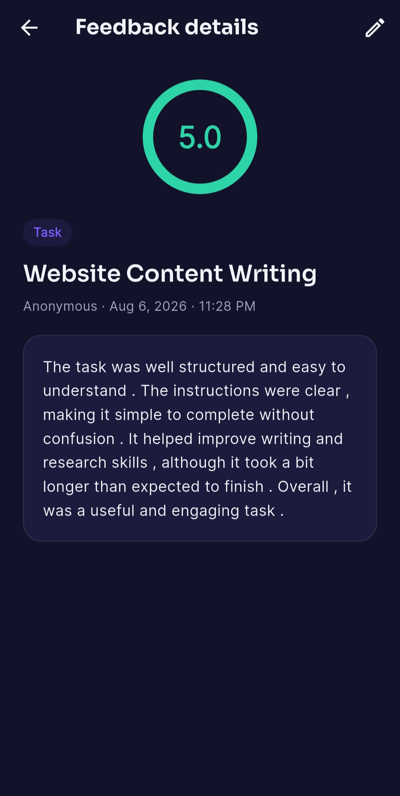
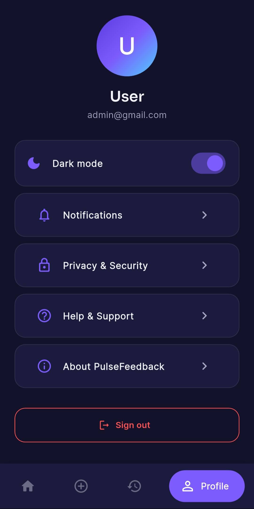

<div align="center">

# 💬 PulseFeedback

**A Real-Time Feedback & Review Management App for Tasks, Courses & Services**

A mobile feedback collection and analytics app built with Flutter and Firebase, designed for organizations to collect structured feedback from users/interns/students and let admins track, respond to, and analyze it in real time.

</div>

---

## 📖 Overview

**PulseFeedback** lets users rate and review tasks, courses, or services with a single tap, while admins get a live dashboard with analytics, moderation tools, and reply capability. Every rating flows through a shared "Sentiment Ring" visual system, real-time Firestore sync, and a fully theme-able light/dark UI.

## 📸 Screenshots

| Login | Home | Submit Feedback |
|:---:|:---:|:---:|
|  |  |  |

| History (Search) | Feedback Detail | Dark Mode |
|:---:|:---:|:---:|
|  |  |  |


## ✨ Features

### 👤 For Users
- 🔐 **Firebase Authentication** - secure email/password sign up & login
- ⭐ **Star Rating + Sentiment Ring** - animated circular dial that colors itself coral → amber → mint based on the rating
- 📝 **Submit Feedback** - rate a Task, Course, or Service with title, message, category and rating
- 🔍 **Search & Filter History** - find past feedback instantly by keyword or category
- ✏️ **Edit / Delete** - update or remove your own feedback while it's still Pending
- 💬 **Admin Replies** - see responses directly on your feedback thread
- 🎉 **Celebration Animation** - a small delightful animation confirms every successful submission
- 🌗 **Dark Mode** - full app-wide light/dark theme toggle

### 🛠️ For Admins
- 📊 **Live Dashboard** - total feedback, pending count, and average rating at a glance
- 🔎 **Search & Status Filters** - Pending / Reviewed / Resolved, searchable by user or keyword
- ✅ **Moderation Screen** - update status and reply to any feedback
- 📈 **Analytics** - 7-day submission trend line, average rating by category (bar chart), status breakdown (pie chart), and category volume
- 🔄 **Real-Time Sync** - every screen updates live via Firestore streams, no manual refresh

### 🎨 Design
- Modern gradient-based UI with a custom "sentiment gradient" design language
- Sora (headings) + Inter (body) typography via Google Fonts
- Smooth micro-animations throughout (`animate_do`)
- Fully responsive light and dark themes

---

## 🛠️ Tech Stack

| Layer | Technology |
|---|---|
| Framework | Flutter (Dart) |
| Authentication | Firebase Authentication |
| Database | Cloud Firestore (real-time streams) |
| State Management | `provider` (theme) + native `StatefulWidget` |
| Charts | `fl_chart` (bar, pie, line) |
| Typography | Google Fonts (Sora + Inter) |
| Animations | `animate_do` |

---

## 🗂️ App Flow

Splash Screen
|
Login <-------> Signup
|
+-- Regular User -----> Home / Submit / History / Profile
| |
| Feedback Detail --> Edit Feedback
|
+-- Admin User --------> Dashboard / Analytics / Profile
|
Moderation Screen (status + reply)

## 📁 Project Structure

lib/
├── main.dart # App entry point, Firebase init, theme wiring
├── firebase_options.dart # Generated by FlutterFire CLI
├── theme/
│ ├── app_theme.dart # Colors, gradients, typography, light + dark themes
│ └── theme_controller.dart # Holds/toggles the current theme mode
├── models/
│ └── feedback_model.dart # FeedbackModel + AppUser
├── services/
│ ├── auth_service.dart # Sign up / sign in / sign out / profile
│ └── feedback_service.dart # Firestore CRUD + real-time streams
├── utils/
│ └── toast.dart # Lightweight SnackBar-based toast helper
├── widgets/
│ └── common_widgets.dart # SentimentRing, StarRatingInput, FeedbackCard,
│ # StatCard, EmptyState, SuccessCelebration, etc.
└── screens/
├── splash_screen.dart
├── auth/ # login_screen.dart, signup_screen.dart
├── user/ # home, submit, history, detail, edit, profile
└── admin/ # dashboard, moderation, analytics

---

## 🚀 Getting Started

### Prerequisites
- [Flutter SDK](https://docs.flutter.dev/get-started/install) installed
- A [Firebase](https://console.firebase.google.com) project
- Android Studio / VS Code with the Flutter extension

### 1. Clone the repository
```bash
git clone https://github.com/YOUR-USERNAME/pulse-feedback-app.git
cd pulse-feedback-app
```

### 2. Generate native platform folders
This repo ships only the Dart source and config - not the machine-generated `android/`, `ios/`, `web/` folders:
```bash
flutter create --project-name feedback_review_app --org com.example .
flutter pub get
```

### 3. Configure Firebase
1. Create a project at [console.firebase.google.com](https://console.firebase.google.com)
2. Enable **Authentication → Sign-in method → Email/Password**
3. Enable **Firestore Database** (start in production mode)
4. Run the FlutterFire CLI to generate `firebase_options.dart`:
```bash
   dart pub global activate flutterfire_cli
   flutterfire configure
```
5. Publish the included `firestore.rules` via **Firestore → Rules** in the console
6. Create the composite index Firestore asks for (`feedback` collection: `userId` Ascending + `createdAt` Descending) via **Firestore → Indexes**

### 4. Run the app
```bash
flutter run
```

### 5. Build a release APK
```bash
flutter build apk --release
```
The generated APK will be located at:

build/app/outputs/flutter-apk/app-release.apk


---

## 🔑 Key Implementation Details

- **Authentication**: `AuthService` wraps `firebase_auth` calls and auto-promotes the very first signed-up account to admin for quick demo purposes - swap this for manual role assignment in production.
- **Real-time data**: `FeedbackService` exposes Firestore streams (`streamUserFeedback`, `streamAllFeedback`) so every list on both the user and admin side updates live with zero manual refresh.
- **Security**: `firestore.rules` enforces that users can only read/edit/delete their own feedback (and only while it's "Pending"), while admins have full read/write access - mirrored in the UI so buttons never promise something the backend would reject.
- **Theming**: a single `ThemeController` (via `provider`) drives light/dark mode app-wide; all custom widgets pull colors through context-aware helpers in `AppColors` instead of hardcoded values.

## 👨‍💻 Developer

**Usman Shahid**
<br>
Flutter + Firebase Feedback & Review System

---

<div align="center">
Built with 💜 using Flutter & Firebase
</div>
